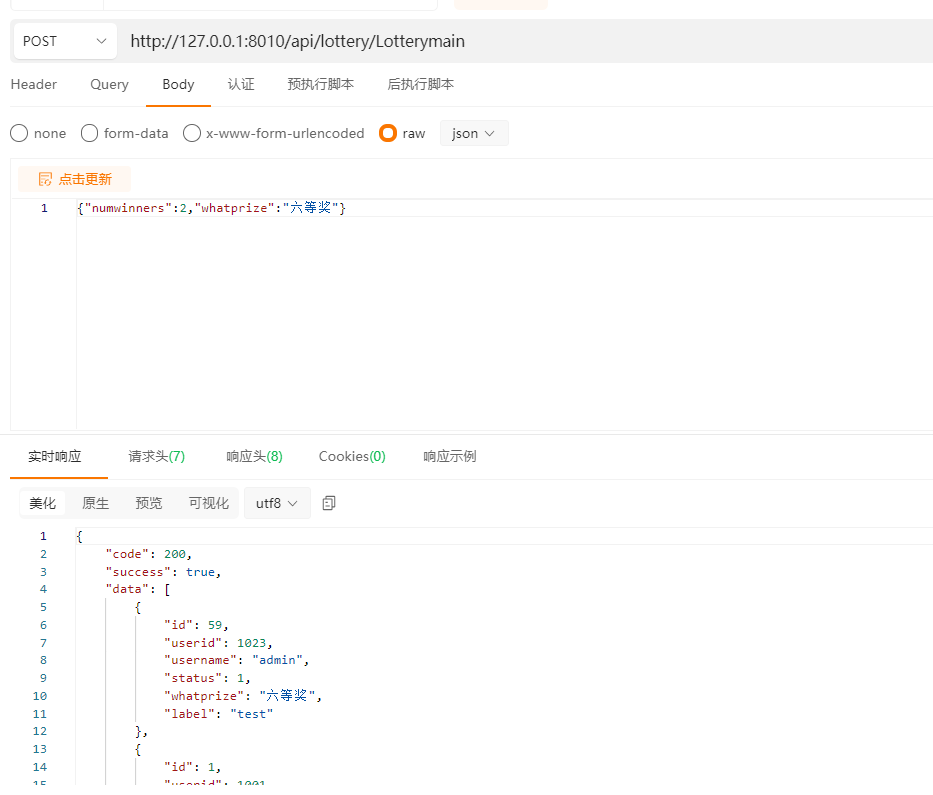
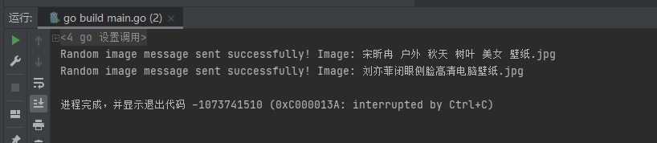

<p align="center">
  <a href="https://github.com/qishu321/gin-onter">
    
  </a>

  <h1 align="center">gin-onter</h1>
  <p align="center">
   本项目使用gin、gorm开发,是一个基础的抽奖程序后端，实现了抽奖去重
    <br />
     <br />
  </p>
## 技术栈

#### 后端 Golang 1.19

- Gin 1.9.1             [(Web框架)](https://gin-gonic.com/zh-cn/)
- GORM v1.9.16     [(ORM)](https://gorm.io/zh_CN/)
- MySQL 5.7             [(数据库)](https://www.mysql.com/)


#### 已实现的功能
- 抽奖后端的增删改查和抽奖执行
- 企业微信机器人随机发送图片
  
  


## 部署方法


```go
clone下来项目，然后修改下conf里的配置内容，然后go build main.go就可以了

API文档地址：
https://console-docs.apipost.cn/preview/55a10356b8dc8979/9ee9f14fcba63590
```

#### 如何参与开源项目

贡献使开源社区成为一个学习、激励和创造的绝佳场所。你所作的任何贡献都是**非常感谢**的。


1. Fork the Project
2. Create your Feature Branch (`git checkout -b feature/AmazingFeature`)
3. Commit your Changes (`git commit -m 'Add some AmazingFeature'`)
4. Push to the Branch (`git push origin feature/AmazingFeature`)
5. Open a Pull Request

### 版本控制

该项目使用Git进行版本管理。您可以在repository参看当前可用版本。

### 联系方式
## 预览


### 版权说明

该项目签署了MIT 授权许可

